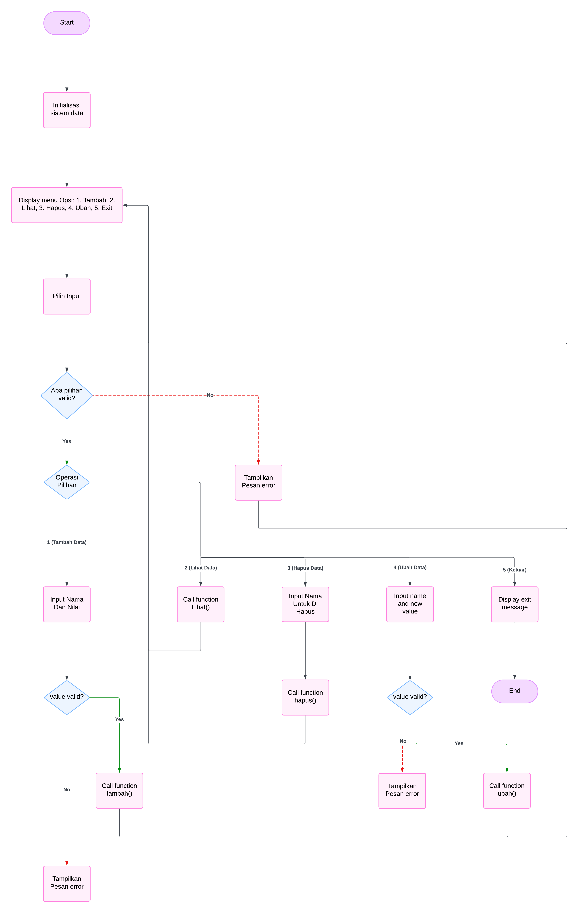

# Tugas Pratikum
Membuat pemrograman fungai tambah, fungsi tampilkan, fungsi hapus, fungsi ubah menggunakan CLASS 

# Codingan 
```
class DataMahasigma : 
    def __init__(self):
        self.DataMahasigma = []
    
    def tambah(self, nama, nilai): 
        self.DataMahasigma.append({"nama" : nama, "nilai": nilai})
        print(f'data {nama} berhasil di tambahkan')
        
    def tampilkan (self):
        if not self.DataMahasigma:
            print("Data Tidak Di Temukan")
        else:
            print("Daftar Nilai Mahasiswa")
            for i, mahasiswa in enumerate(self.DataMahasigma, start= 1) :
                print(f"{i}. Nama: {mahasiswa['nama']}\n   Nilai: {mahasiswa['nilai']}")
                
    def hapus (self, nama):
        for mahasiswa in self.DataMahasigma:
            if mahasiswa ['nama'] == nama:
                self.DataMahasigma.remove(mahasiswa)
                print(f"Data {nama} Mahaiswa Berhasil Di Hapus")
                return
        print("Data Tidak Di Temukan")
    
    def ubah (self, nama, nilai_baru):
        for mahasiswa in self.DataMahasigma:
            if mahasiswa ["nama"] == nama:
                mahasiswa ["nilai"] = nilai_baru
                print(f"Data {nama} Berhasil Di Ubah")
                return
            print("Data Tidak Di Temukan")
                
if __name__ == '__main__':
    data = DataMahasigma()
    
    while True:
        print("\n=====Menu Daftar Mahasiswa=====")
        print("1. Tambah Data")
        print("2. Tampilkan Data")
        print("3. Hapus Data")
        print("4. Ubah Data")  
        print("5. Keluar")
        
        try :
             pilihan = int(input("Masukan PIlihan (1-5): "))
        except ValueError:
            print("Masukkan angka yang valid!")
            continue

        if pilihan == 1:
            nama = input("Masukkan nama mahasiswa: ")
            try:
                nilai = float(input("Masukkan nilai mahasiswa: "))
                data.tambah(nama, nilai)
            except ValueError:
                print("Nilai harus berupa angka!")
                
        elif pilihan == 2:
            data.tampilkan()
            
        elif pilihan == 3:
            Nama = input("Masukan Nama Yang Ingin Di Hapus: ")
            data.hapus(Nama)
            
        elif pilihan == 4:
            Nama = input("Masukan Nama Mahasiswa Yang Ingin Di Ubah Nilainya: ")
            try:
                nilai_baru = input("Masukan Nilai Baru: ")
                data.ubah(Nama, nilai_baru)
            except ValueError:
                print("Nilai Harus Berupa Angka")
                
        elif pilihan == 5:
            print("Program telas Selesai, Terima Kasih")
            break 
        
        else:
            print("Pilihan Tidak Valid, Silakan Pilih Menu (1-5).")
```
# Penjelasan
Penjelasan Program Utama:
1. Class PersonManager
Digunakan untuk mengelola data mahasiswa, seperti menambah, menampilkan, menghapus, atau mengubah data.

2.Menu Interaktif:
Program menyediakan menu untuk memilih operasi:
1: Tambah data mahasiswa.
2: Tampilkan semua data mahasiswa.
3: Hapus data mahasiswa berdasarkan nama.
4: Ubah nilai mahasiswa berdasarkan nama.
5: Keluar dari program.

3. Validasi Input:
Menggunakan try-except untuk menangani input yang tidak valid, seperti saat memasukkan nilai yang seharusnya berupa angka.

4. Pengulangan Program:
Menggunakan while True agar program terus berjalan sampai pengguna memilih opsi untuk keluar.

# Output
# Fungsi Tambah
```
=====Menu Daftar Mahasiswa=====
1. Tambah Data
2. Tampilkan Data
3. Hapus Data
4. Ubah Data
5. Keluar
Masukan PIlihan (1-5): 1
Masukkan nama mahasiswa: vito
Masukkan nilai mahasiswa: 9
data vito berhasil di tambahkan
```

# Fungsi Tampilkan
```
=====Menu Daftar Mahasiswa=====
1. Tambah Data
2. Tampilkan Data
3. Hapus Data
4. Ubah Data
5. Keluar
Masukan PIlihan (1-5): 2
Daftar Nilai Mahasiswa
1. Nama: vito
   Nilai: 9.0
```

# Fungsi Hapus
```
=====Menu Daftar Mahasiswa=====
1. Tambah Data
2. Tampilkan Data
3. Hapus Data
4. Ubah Data
5. Keluar
Masukan PIlihan (1-5): 3
Masukan Nama Yang Ingin Di Hapus: vito
Data vito Mahaiswa Berhasil Di Hapus
```

# Fungsi Ubah
```
=====Menu Daftar Mahasiswa=====
1. Tambah Data
2. Tampilkan Data
3. Hapus Data
4. Ubah Data
5. Keluar
Masukan PIlihan (1-5): 4
Masukan Nama Mahasiswa Yang Ingin Di Ubah Nilainya: vito
Masukan Nilai Baru: 8
Data vito Berhasil Di Ubah
```

# Fungsi Keluar
```
=====Menu Daftar Mahasiswa=====
1. Tambah Data
2. Tampilkan Data
3. Hapus Data
4. Ubah Data
5. Keluar
Masukan PIlihan (1-5): 5
Program telas Selesai, Terima Kasih
```

# Flowchart 

